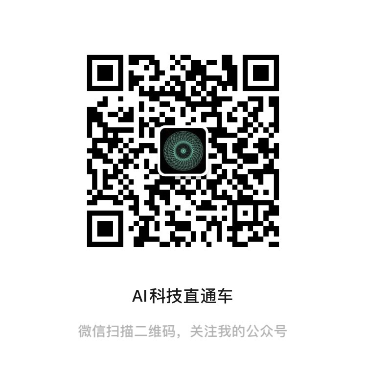
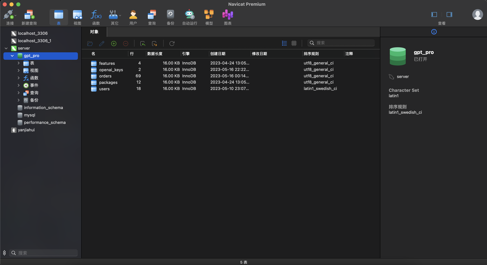
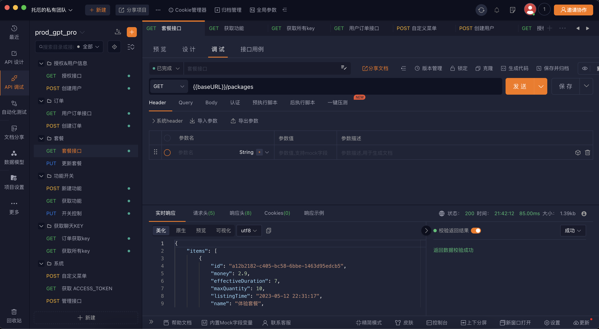
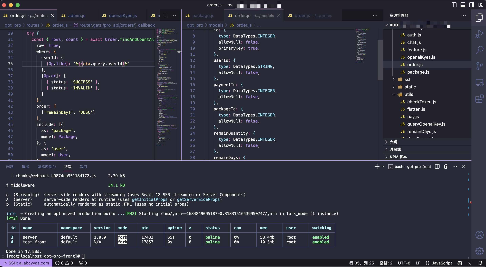
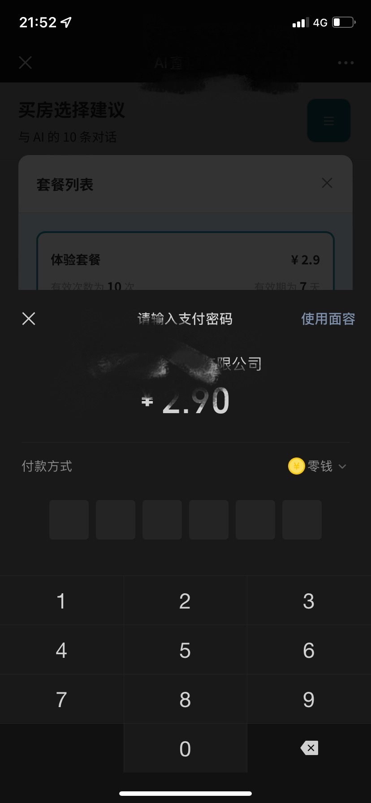
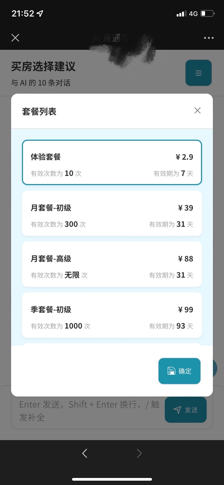
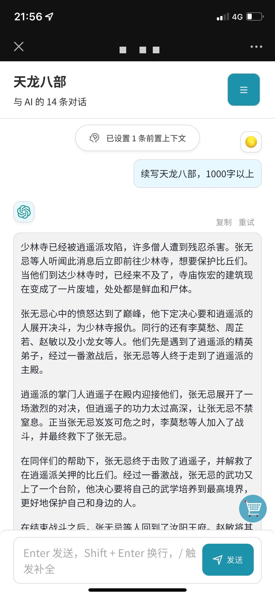

# WeChat-GPT
微信公众号H5接入OpenAI对话，可以授权、支付等功能。已有成功上线案例，可以定制化需求开发。

## 成功案例

## 技术栈
### 前端
- Next
- HTML
- CSS

### 后端
- Node
- Koa
- PM2
- Sequelize

### 数据库
- MySQL

## 提供
- 未混淆源码（可完美二开）
- 后端接口文档
- 初始化 SQL 文件

## 需准备
- 4核8G 或以上配置服务器
- 商户号
- 备案域名
- 公众号（非订阅号）

## 效果图
### 后台系统

### 公众号H5

|    |   |    |
| --- | --- | --- |

## 联系我
WeChat: yanjiahui12345

